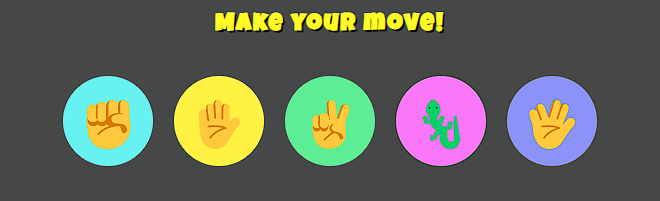
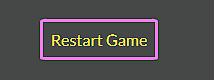
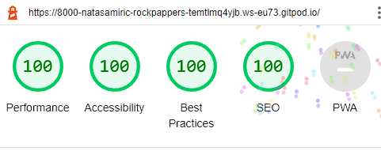

#ROCK PAPER SCISSORS LIZARD SPOCK GAME

The Rock Paper Scissors Lizard Spock game is an extended version of an old, classic Rock Paper Scissors game. Namely, it appeared first time on a TV Show named "The Big Bang Theory". This new version of the game has provided the players with much more choices, which means that it added some complexity, fun and reduced the chances of a tie match. 

In this version, the user will play against the computer which means that he will always have an opponent available to play with. The user will be presented with five options and choose one of them in each round - Rock, Paper, Scissors, Lizard, Spock. When a user clicks on one option, the opponent (computer) will throw out a random selection. Rock Paper Scissors Lizard Spock Game game will be targeted towards people of all ages that want to have fun and perhaps help to settle a dispute instead of going with the old way of flipping a coin.

Visit the deployed site: [Rock Paper Scissors Lizard Spock Game](https://natasamiric.github.io/rock-papper-scissors-lizard-spock/)

## Contents

* [User Stories](#User-Stories)

* [Design](#Design)
  * [Color Scheme](#Color-Scheme)
  * [Typography](#Typography)  
  * [Wireframes](#Wireframes)

* [Features](#Features)
  * [Existing features](#existing-features)
  * [Future Implementations](#futute-implementations)
  
* [Technologies Used](#Technologies-Used)
  * [Languages Used](#Languages-Used)
  * [Frameworks, Libraries & Programs Used](#Frameworks,-Libraries-&-Programs-Used) 

* [Testing](#Testing)
  * [Validator Testing](#validator-testing)
  * [Lighthouse](#lighthouse)
  * [Testing User Stories](#testing-user-stories)
      
 * [Deployment](#Deployment)

* [Credits](#Credits)
  * [Code Used](#Code-Used)
  * [Content](#Content)
  * [Media](#Media)
  * [Acknowledgments](#Acknowledgements)

---
## User Stories

* As a visiting user, I would like to be able to choose between rock, paper, scissors, lizard and spock.
* As a visiting user, I would like to be able to see my choice and the computer's choice.
* As a visiting user, I would like to be able to see the outcome of our moves.
* As a visiting user, I would like to be able to follow the score of the game.

## Design

### Color Scheme

  

  The chosen colors for the buttons are vibrant to add a positive character and playfulness to the website. The dark grey background color provides good contrast. 

### Typography

  [Google Fonts](https://fonts.google.com/) was used for the following font: 
 
  * Font-family: 'Lato', sans-serif- for the rules description.
  * Font-family: 'Luckiest Guy' - for the rest of the content on the page. 

 The emojis were imported from the [Get Emoji](https://getemoji.com/).

 ### Wireframes

 Wireframes were created for the desktop and mobile.

 [Desktop and mobile wireframe](docs/wireframes/wireframe.png)

 ## Features

### Existing features

**Header**

  * Featured on the top of the page and holds the name of the Rock Paper Scissors Lizard Spock Game.
  * Fun font and large size of the header clearly tell the user what game they are playing.

  

**The Game Options**

  * The Game Options include instruction for the user to make a move, and an option of five clickable buttons presented in a form of emojis for rock, paper, scissors, lizard and spock.
  * This section provides interactive buttons where the user can make a selection and play the game. 

  

**The Game result**

  * The Game result is positioned underneath the option buttons and shows the user's and computer's choice with the announcement whether user wins or loses current round of the game.
  * When the user makes a selection, the Java Script code randomly generates the computer's choice and the announcement of the result is presented to the user.  
  * The results are valuable to the user to know what computer has selected and if he won or lost the round.  

  

**Score**

  * The score is showing user's and computer's points and updating in each round depending on who is the winner. 
  * It helps the user to keep updated on who leads the game and who will be the winner.   

  

**Restart Game**

  * The restart button allows the user to click on it and start a new game from the beginning.
  * This feature is valuable to the user because it gives clear instructions to a user where he needs to click to restart the game instead of clicking on reload page button. 

  

**Rules**

  * Beneath the score are displayed  the rules of the game Rock Paper Scissors Lizard Spock.
  * This section is valuable to the user to understand how the game is played.  

  

**Footer**

  * Footer is located at the bottom of the page and contains the GitHub and Linkedin pages of the project creator. 
  * It is valuable to the creator to present herself and her work and make new connections.  

### Future Implementations

  * Making a limited number of rounds and announce a winner.   

## Technologies Used

### Languages Used

  HTML, CSS and Java Script were used for creating this project. 

### Programs Used

  Balsamiq- was used to create wireframes.

  GitHub- was used to store the project and display it on GitHub Pages.

  Git -was used for version control.

  [Google Fonts](https://fonts.google.com/) - was used to import the fonts used on the website.

  [Get Emoji](https://getemoji.com/) - was used for importing the emojis.

  Google Dev Tools - to troubleshoot and test features, and solve issues with responsiveness and styling.

  [Am I Responsive?](https://ui.dev/amiresponsive) - was used to show the website image on a range of devices.

  [Adobe Color](https://color.adobe.com/create/color-wheel) - was used for creating a color palette.

  [Font Awesome](https://fontawesome.com/) - was used for the social media icons. 

## Testing

  Testing was conducted throughout the website development with the help of Dev Tools. External links are tested on all browsers and they are opening in a new tab and lead to the intended destination. 

  I performed testing of buttons to make sure that every time I click: 
 
  * Every button is in function and displaying the correct value.
  * It is possible to choose the same button several times.
  * Computer always displays some random value and it is changing it in each round.
  * Score gets updated after each round. 
  * Result message is displayed after every move. 
  * Restart button always returs user to the beginning of the game. 

  I confirmed that this project is responsive, looks good and functions on standard screen sizes using the dev tools device toolbar.

* The website has been checked on multiple browsers and mobile devices:

  * Google Chrome
  * Firefox
  * Opera
  * Microsoft Edge
  * Samsung Galaxy S10+
  * Galaxy Fold
  * Samsung Galaxy S8
  * Samsung Galaxy S20 Ultra
  * Iphone 5/6/7/8
  * Iphone 12 Pro
  * Ipad Pro
  * Ipad Mini

### Validator Testing

* HTML
  * No errors returned when passing through the official W3C validator.
* CSS
  * No errors found when passing through the official Jigsaw validator.
* Java Script
  * The code has passed through the JSHint validator. 

### Lighthouse

* I run the lighthouse test for desktop and mobile to confirm that the page has good accessibility.

  
  

### Testing User Stories

**As a visiting user, I would like to be able to choose between rock, paper, scissors, lizard and spock.**

  * When landing on the page, it is clearly displayed to the user the instruction to make a move and beneath it the five options: rock, paper, scissors, lizard and spock. 
  * When the user hovers over the buttons they magnify and the orange border is present.
  * User should click on one of the five options. 

   

**As a visiting user, I would like to be able to see my choice and the computer's choice.**

  * After making a choice/clicking on one of the options, the user is able to see his and computer's choice in the result area beneath the play buttons.  

**As a visiting user, I would like to be able to see the outcome of our moves.**

  * The message is displayed beneath the play buttons after each round. 
  * After clicking on one of the five options, the user gets the message did he won or lost, or is it a tie. 

  

**As a visiting user, I would like to be able to follow the score of the game.**

  * After every move/click on button, the user is able to see who gets the score and be updated of who is winning the game.  

  

## Deployment

* via Gitpod
  * Log into GitHub.
  * Make a repository from Code Institute template
  * Click the green button close to the top of the page that says Gitpod.
  * After letting Gitpod load an alert pops up on the top of the screen, click cancel.
  * Then click the button that says More Actions.
  * Hereafter click Open in Browser.
  * Now right-click with your mouse over the big box on the left that has your repository name over it.
  * Click the new file.
  * Then make an index.html file.
  * Go to the top of the index file and click ! and enter. This will make a start template.
  * Make a basic structure for your index page.
  * Click on a terminal at the bottom of the page.
  * Write 'git add .'
  * Then for your first commit write 'git commit -m "Initial commit".
  * Hereafter write 'git push'.
  * Your code has now been pushed back and saved on your GitHub repository.

* via GitHub pages
  * Log into GitHub.
  * Go to the repositories.
  * Then take this project Rock Paper Scissors Lizard Spock.
  * Go to the settings link.
  * Then click on the pages link that is found on the navigation bar on the left side.
  * Check the source section on the page, and choose main instead of none.
  * Then click Save. After a few minutes, you can see your live GitHub page site is now deployed and the URL is shown at the top of the page.

  Live GitHub page: https://natasamiric.github.io/rock-papper-scissors-lizard-spock/

## Credits
### Code Used

* Several tutorials on developing a Rock Paper Scissors game were viewed but no code was used directly from these tutorials and was used solely for inspiration on how to implement the game. These tutorials are: 

  [Code with Ania Kubow](https://www.youtube.com/watch?v=RwFeg0cEZvQ&t=631s)

  [Web Dev Simplified](https://www.youtube.com/watch?v=1yS-JV4fWqY&t=1002s)

  [freeCodeCamp](https://www.youtube.com/watch?v=jaVNP3nIAv0&t=4297s)

### Content

  * The rules of the game were taken from : https://bigbangtheory.fandom.com/wiki/Rock,_Paper,_Scissors,_Lizard,_Spock

### Media

  * The emojis were imported from the [Get Emoji](https://getemoji.com/).

###  Acknowledgments

I would like to thank my tutor Rohit Sharma for his support and guidance throughout the creation of the project.
