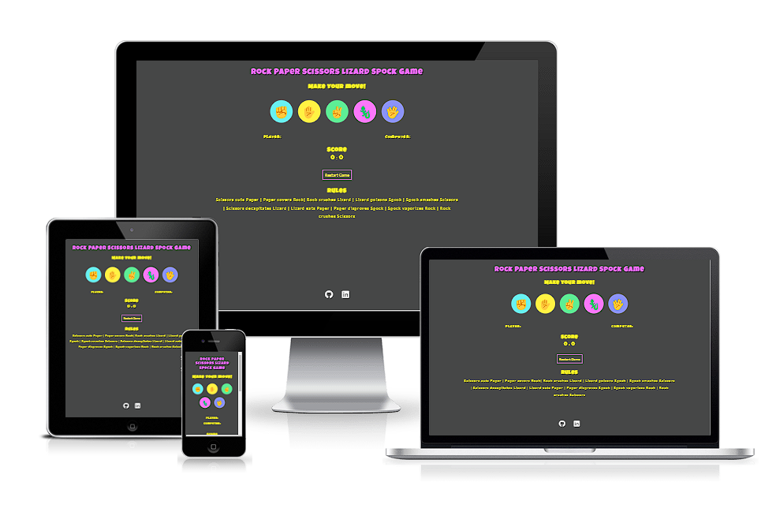
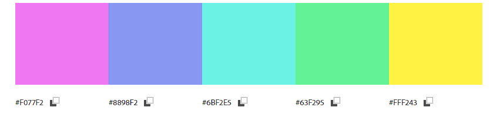
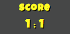

#ROCK PAPER SCISSORS GAME

The Rock Paper Scissors game is a fun game that can be played anywhere and anytime between at least two people with the help of their own hands. This game can be played by children and adults and the rules are very simple. Rock wins against scissors, scissors win against paper and paper wins against the rock.

In this version, the user will play against the computer which means that he will always be able to have an opponent available to play with. The user will be presented with three options - rock, paper, scissors - that he will click on, while the opponent (computer) will throw out a random selection. Rock Paper Scissors game will help the users to have some fun, relax, and perhaps in making a decision instead of going with the old way of flipping a coin.

Visit the deployed site: [Rock Paper Scissors Game](https://natasamiric.github.io/rock-papper-scissors/)

## Contents

* [User Stories](#User-Stories)

* [Design](#Design)
  * [Colour Scheme](#Colour-Scheme)
  * [Typography](#Typography)  
  * [Wireframes](#Wireframes)

* [Features](#Features)
  * [Existing features](#existing-features)
  * [Future Implementations](#futute-implementations)
  
* [Technologies Used](#Technologies-Used)
  * [Languages Used](#Languages-Used)
  * [Frameworks, Libraries & Programs Used](#Frameworks,-Libraries-&-Programs-Used) 

* [Testing](#Testing)
      
 * [Deployment](#Deployment)

* [Credits](#Credits)
  * [Code Used](#Code-Used)
  * [Content](#Content)
  * [Media](#Media)
  * [Acknowledgments](#Acknowledgements)

---
## User Stories

* As a visiting user, I would like to be able to choose between rock, paper and scissors.
* As a visiting user, I would like to be able to see my choice and the computer's choice.
* As a visiting user, I would like to be able to see the outcome of our moves.
* As a visiting user, I would like to be able to follow the score of the game.

## Design

### Colour Scheme

The chosen colors are vibrant and bright to add a positive character and playfulness to the website.

### Typography

[Google Fonts](https://fonts.google.com/) was used for the following font: 

 * Font-family: 'Luckiest Guy', cursive;

 The emojis were imported from the [Get Emoji](https://getemoji.com/).

 ### Wireframes

 Wireframes were created for the desktop and mobile.

 

 ## Features
 
### Existing features

**Header**

* Featured on the top of the page and consisting the name of the game Rock Paper Scissors Game.
* Fun font and large size of the header clearly tells the user what game they are playing.

**Rules**

* Beneath the header, rules of the game Rock Paper Scissors are displayed.
* This section is valuable to the user to understand how the game is played.  

**The Game Options**

* The Game Options includes an instruction for the user to make a move and an option of three clickable buttons presented in a form of emojis for rock, paper and scissors.
* This section provides and interactive buttons where the user can make a selection and play the game. 

**The Game result**

* The Game result is positioned underneath the option buttons and shows the user's and computer's choice with the announcement if a user wins or loses, or is it a tie.
* When the user makes a selection, the Java Script code randomly generates the computer's choice and the announcement of the result is presented to the user.  
* The results are valuable to the user to know what computer has selected and if he won or lost the round.  

**Score**

* The score is showing user's and computer's point and updating in each round depending on who is the winner. 
* It helps the user to keep updated who leads the game and who will be the winner.   

**Footer**

* Footer is located at the bottom of the page and contains the GitHub and Linkedin page of the project creator. 
* It is valuable to the creator to present herself and her work and make new connections.  

### Future Implementations

## Technologies Used
### Languages Used

HTML, CSS and Java Script were used for creating this project. 

### Programs Used

Balsamiq- was used to create wireframes.

GitHub- was used to store the project and display it on GitHub Pages.

Git -was used for version control.

[Google Fonts](https://fonts.google.com/) - was used to import the fonts used on the website.

[Get Emoji](https://getemoji.com/) - was used for importing the emojis.

Google Dev Tools - to troubleshoot and test features, and solve issues with responsiveness and styling.

[Am I Responsive?](https://ui.dev/amiresponsive) - was used to show the website image on a range of devices.

[Adobe Color](https://color.adobe.com/create/color-wheel) - was used for creating a color palette.

## Testing

## Deployment

* via Gitpod
  * Log into GitHub.
  * Make a repository from Code Institute template
  * Click the green button close to the top of the page that says Gitpod.
  * After letting Gitpod load an alert pops up on the top of the screen, click cancel.
  * Then click the button that says More Actions.
  * Hereafter click Open in Browser.
  * Now right-click with your mouse over the big box on the left that has your repository name over it.
  * Click the new file.
  * Then make an index.html file.
  * Go to the top of the index file and click ! and enter. This will make a start template.
  * Make a basic structure for your index page.
  * Click on a terminal at the bottom of the page.
  * Write 'git add .'
  * Then for your first commit write 'git commit -m "Initial commit".
  * Hereafter write 'git push'.
  * Your code has now been pushed back and saved on your GitHub repository.

* via GitHub pages
  * Log into GitHub.
  * Go to the repositories.
  * Then take this project Rock Paper Scissors.
  * Go to the settings link.
  * Then click on the pages link that is found on the navigation bar on the left side.
  * Check the source section on the page, and choose main instead of none.
  * Then click Save. After a few minutes, you can see your live GitHub page site is now deployed and the URL is shown at the top of the page.

## Credits
### Code Used
###  Media
###  Acknowledgments
