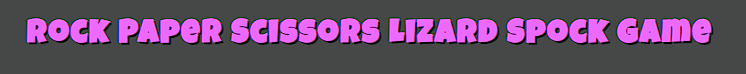

#ROCK PAPER SCISSORS GAME

The Rock Paper Scissors game is a fun game that can be played anywhere and anytime between at least two person with the help of their own hands. This game can be played by children and adults and the rules are very simple. Rock wins against scissors, scissors win against paper and paper wins against rock. In this version the user will play against the computer which means that he will always be able to have a teammate available and avoid searching for a person to play with. Rock Paper Scissors game will help the users to have some fun and relax.

Visit the deployed site: [Rock Paper Scissors Game](https://natasamiric.github.io/rock-papper-scissors/)

## Contents

* [User Stories](#User-Stories)

* [Design](#Design)
  * [Colour Scheme](#Colour-Scheme)
  * [Typography](#Typography)  
  * [Wireframes](#Wireframes)

* [Features](#Features)
  * [Existing features](#existing-features)
  * [Future Implementations](#futute-implementations)
  
* [Technologies Used](#Technologies-Used)
  * [Languages Used](#Languages-Used)
  * [Frameworks, Libraries & Programs Used](#Frameworks,-Libraries-&-Programs-Used) 

* [Testing](#Testing)
      
 * [Deployment](#Deployment)

* [Credits](#Credits)
  * [Code Used](#Code-Used)
  * [Content](#Content)
  * [Media](#Media)
  * [Acknowledgments](#Acknowledgements)

---
## User Stories

* As a visiting user, I would like to be able to make a choice between rock, papper and scissors.
* As a visiting user, I would like to be able to see my choice and computer's choice.
* As a visiting user, I would like to be able to see the outcome of our moves.
* As a visiting user, I would like to be able to follow the score of the game.

## Design

### Colour Scheme

The chosen colors are vibrant and bright to add a positive character and playfulness to the website.

### Typography

[Google Fonts](https://fonts.google.com/) was used for the following font: 

 * Font-family: 'Luckiest Guy', cursive;

 ### Wireframes

 Wireframes were created for the desktop and mobile.

 

 ## Features
### Existing features

**Header**

**Rules**

**The play buttons**

**The Game result**

**Footer**

### Future Implementations

## Technologies Used
### Languages Used

HTML, CSS and Java Script were used for creating this project. 

### Programs Used

Balsamiq- was used to create wireframes.

Github- was used store the project and display on GitHub Pages.

Git -was used for version control.

[Google Fonts](https://fonts.google.com/) - was used to import the fonts used on the website.

[Get Emoji](https://getemoji.com/) - was used for importing the emojis.

Google Dev Tools - to troubleshoot and test features, solve issues with responsiveness and styling.

[Am I Responsive?](https://ui.dev/amiresponsive) - was used to show the website image on a range of devices.

[Adobe Color](https://color.adobe.com/create/color-wheel) - was used for creating color palette.

## Testing

## Deployment

* via gitpod
  * Log into GitHub.
  * Make a repository
  * Click the green button close to the top of the page that  says Gitpod.
  * After letting Gitpod load an alert pops up on the top of the screen, click cancel.
  * Then click the button that says More Actions.
  * Hereafter click Open in Browser.
  * Now right click with your mouse over the big box on the left that has your repository name over it.
  * Click new file.
  * Then make an index.html file.
  * Go to the top of the index file and click ! and enter. This will make a start template.
  * Make a basic structure for your index page.
  * Click on terminal at the bottom of the page.
  * Write 'git add .'
  * Then for your first commit write 'git commit -m "Initial commit".
  * Hereafter write 'git push'.
  * Your code have now been pushed back and saved on your GitHub repository.

  * via GitHub pages
  * Log into GitHub.
  * Go to the repositories.
  * Then take this project Rock Paper Scissors.
  * Go to the settings link.
  * Then click on the pages link that is found on the navigations bar on the left side.
  * Check the source section on the page, and choose main instead of none.
  * Then click Save. After a few minutes you can see your live GitHub pages site is now deployed and the URL shown at the top of the page.

## Credits
### Code Used
###  Media
###  Acknowledgments
